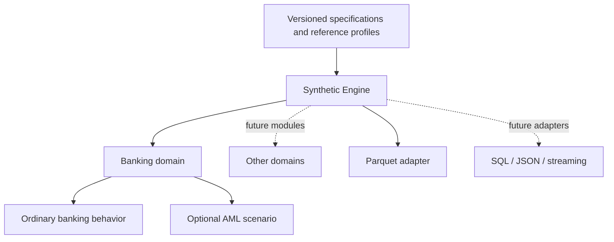

# Synthetic Engine

A Python engine for reproducible synthetic datasets grounded in documented
references. The engine provides orchestration and delivery; domain modules define
entities and behavior; optional scenarios add specific use cases.

**Banking is the first domain. AML is one optional scenario inside banking.**
Future domains may cover retail, logistics, telemetry or other data, each with its
own references, configuration and acceptance tests.

## Architecture



## Status

v0.3 implements a local domain registry, configuration contracts, batch generation,
Parquet delivery, optional ground truth, evidence manifests and integrity validation.
The banking module provides both a baseline and an AML example. No cloud workload
infrastructure has been deployed.

The default banking preset is literature-informed. Optional [reference calibration](docs/calibration.md)
now fits conditional payment-amount distributions to **IBM's synthetic HI-Small
benchmark**, with source hashes and held-out diagnostics. This is partial parameter
calibration; timing, relationships and AML scenarios remain assumptions. No real
customer banking records have been used.

## Quick start with uv

Install [uv](https://docs.astral.sh/uv/getting-started/installation/), then:

```sh
uv sync --locked
uv run --locked synthetic-engine domains
uv run --locked synthetic-engine generate --config configs/banking/baseline.json --output outputs/banking
uv run --locked synthetic-engine generate --config configs/banking/aml-demo.json --output outputs/aml
uv run --locked synthetic-engine validate outputs/aml
uv run --locked pytest -q
```

`uv.lock` is the dependency source of truth. `.python-version` selects Python
3.14.4, the tested Linux development runtime. Python 3.11+ is allowed by package
metadata, but other interpreter/platform combinations need their own validation.
The `dev` dependency group is installed by default. Virtual environments and
outputs remain outside Git. Always use a new output directory.

Each demo generates 100,000 transactions across 5,000 accounts, 30 banks, five
countries and 30 days. The AML example requests a simulated 0.4% illicit fraction;
actual prevalence is reported after complete-scenario rounding. The baseline
exports no AML ground truth or classification target.

## Repository map

```text
specs/                         product/domain/scenario contracts, plans and tasks
configs/<domain>/              runnable domain examples
src/synthetic_engine/
  config.py, core.py            common configuration and domain protocol
  registry.py                  explicit domain registration
  engine.py, validation.py     orchestration and shared integrity checks
  outputs/                     domain-independent delivery adapters
  calibration/                 shared reference fitting, sampling and comparison
  domains/banking/             banking config, generator, validator and evidence
    scenarios/aml.py           optional AML behavior and topology checks
tests/                         domain and engine acceptance tests
docs/                          usage, extension guide and roadmap
references/                    source-documentation template
```

## Specification-driven development

Start with [the specification workflow](specs/README.md). New domains begin with
[a specification template](specs/templates/domain.md), named references, output
contracts and testable acceptance criteria. Follow the [extension guide](docs/adding-domains.md)
to implement them. This is a lightweight repository workflow, not automatic
simulation generation from papers.

## Next milestones

See [the roadmap](docs/roadmap.md): broader reference calibration, another reference-backed
domain, additional output adapters, larger-run sizing, reviewed cloud batch
execution, and streaming. The 15 GB goal belongs to the banking/AML use case,
not a requirement imposed on every engine domain.

[Banking usage and limits](docs/local-engine.md) · [GCP setup](docs/gcp-setup.md) ·
[Reference template](references/template.yaml)
